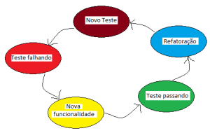

## [TDD e Java: testes automatizados com JUnit](https://cursos.alura.com.br/course/tdd-java-testes-automatizados-junit)

---

### 02. JUnit

* JUnit é um framework que facilita o desenvolvimento e execução de testes unitários Java.
* JUnit é uma biblioteca gratuita e de código aberto
* Fornece uma API para construir os testes e Aplicações gráficas e em modo console para executar os testes criados.

---

### 03. TDD: Test-Driven Development

* **O que é TDD?**
    * Desenvolvimento orientado a teste é um processo em que se escreve o teste antes de escrever o código
* **Como funciona?**
    * Se baseia em pequenos ciclos de repetições, onde para cada funcionalidade do sistema um teste é criado antes. Este
      novo teste criado inicialmente falha, já que ainda não existe a implementação da funcionalidade em questão e, em
      seguida, é implementado a funcionalidade para fazer o teste passar.
* **Ciclo de desenvolvimento:**
    * Escreva um Teste que inicialmente não passe (Red)
    * Adicione uma nova funcionalidade do sistema
    * Faça o Teste passar (Green)
    * Refatore o código da nova funcionalidade (Refactoring)
    * Escreva o próximo Teste
      
* **Por que utilizar?**
    * Feedback rápido sobre a nova funcionalidade e sobre as outras funcionalidades existentes no sistema
    * Clean code, já que se escreve códigos simples para o teste passar
    * Segurança no Refactoring pois fica visivel o que esta ou não afetando
    * Segurança na correção de bugs
    * Maior produtividade
    * Ajuda a manter o foco
    * Evita testes "viciados" na implementação
    * Código da aplicação flexível, já que para escrever testes temos que separar em pequenos "pedaços" o nosso código,
      para que sejam testáveis, ou seja, nosso código estará menos acoplado.
* **Quando utilizar o TDD?**
    * O TDD é mais usado para implementar funcionalidades complexas, quando a estrutura ainda não está totalmente clara
      desde o começo. Nesses casos, o TDD é de grande ajuda, pois funciona como um rascunho.
    * Porém, ao trabalhar com códigos mais simples, sem muitos problemas de design, talvez não valha a pena usar o TDD.
* **Apenas classes com regras de negócios devem ser testadas**

---

### [Certificado](https://cursos.alura.com.br/user/wesleyschwartzz/course/tdd-java-testes-automatizados-junit/certificate)